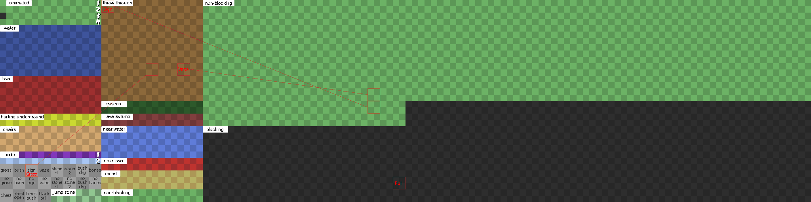

# Tileset - New Order (Type 1)

The type 1 tileset was created along with the New World project.
It was first introduced to the mainline clients in version 2.04,
along with the [addtiledef](scripting-gs1-commands.md#addtiledef) command.

The tileset is organized, unlike the default type 0 tileset.
Despite what it may seem, it lacks the default client functionality that is expressed by the type 0 tileset.

### How to use

The tileset image has a maximum size of 2048x512 pixels, and must be an indexed PNG/GIF image.

The tileset is activated using the [addtiledef](scripting-gs1-commands.md#addtiledef) command, using `1` as the tileset type.

```
addtiledef my-tileset.png,levelprefix_,1;
```

### Template

[Image](images/type1-template.png)



### Notes:

- The tile at position `(0, 2)` (3rd tile down on the first column) is a blocking tile ([tiletype 22](tileset.md#tile-types)) and is used to render the out-of-bounds tiles of the level.
- The specified tiles for grass, bush, sign, etc., have no client functionality (2.x verified).

### Known issues

These issues have been verified on 2.x clients only, and may or may not affect newer clients.

- Tileset type 0 interactions are not disabled, resulting in unexpected behavior, like being able to pick up a sign out of the `throw through` ([tiletype 20](tileset.md#tile-types)) tiles.  The template shows which tiles have issues.
- The [tiletype()](tileset.md#tile-types) function on the client identifies the `lava` ([tiletype 12](tileset.md#tile-types)) tiles as `water` ([tiletype 11](tileset.md#tile-types)).
The lava tiles still render correctly, and you still take damage when swimming in it.
- You don't take damage from the `hurting underground` ([tiletype 2](tileset.md#tile-types)) tiles like you do on the type 0 tileset.